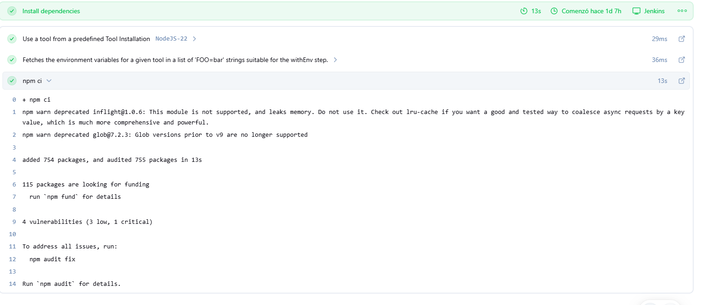
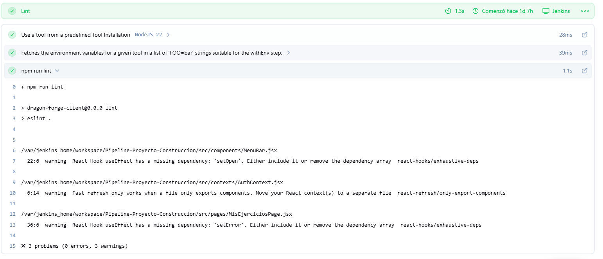
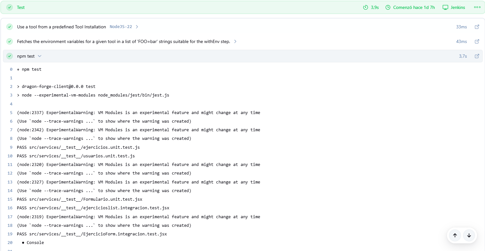
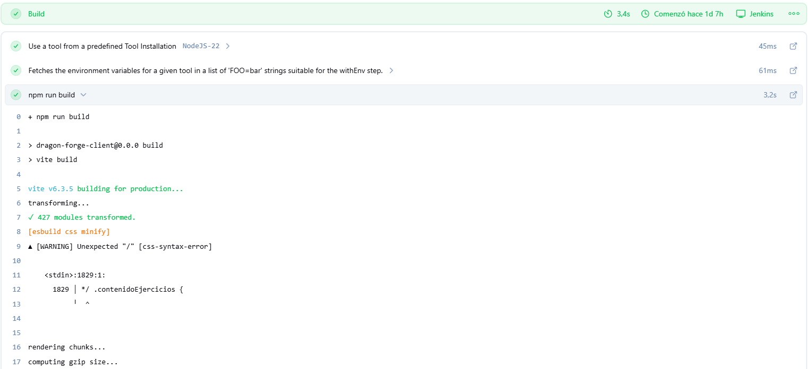
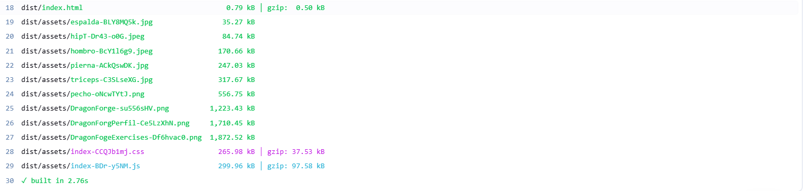
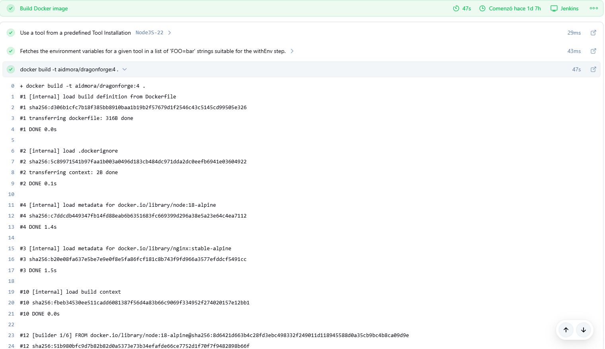
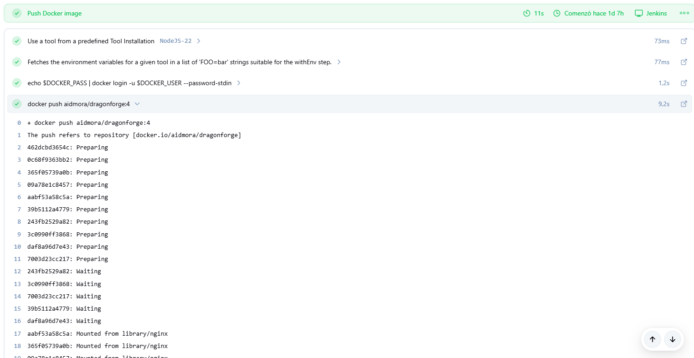
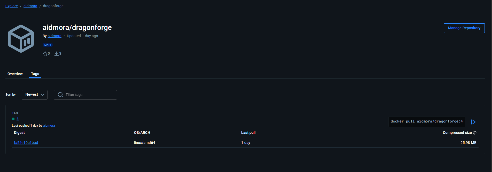
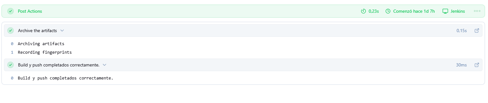
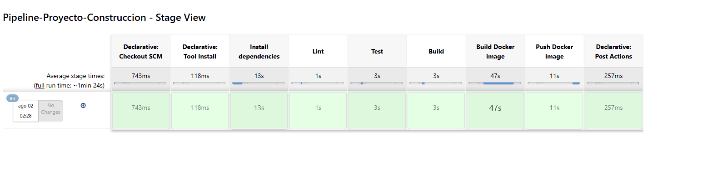

# Documentación del Pipeline
<div align="center">

<div align="center">


  
**Automatización CI/CD para React + Vite**

**Proyecto II**

</div>

Mora Ariel

Nagua Fernando
  
</div>

## Propósito

Este `Jenkinsfile` orquesta el **CI/CD** de tu proyecto **React + Vite** en la rama `main`, automatizando:

- Instalación de dependencias
- Validación de estilo y ejecución de tests
- Compilación de la aplicación
- Construcción y push de la imagen Docker
- Archivo de artefactos generados

---

## Partes principales

1. **Declaración del pipeline**
2. **Agente y herramientas**
3. **Variables de entorno**
4. **Stages (etapas)**
    - Install dependencies
    - Lint
    - Test
    - Build
    - Build Docker image
    - Push Docker image
5. **Post-actions**

---

## Detalle del Jenkinsfile

### 1️⃣ Declaración del pipeline y configuración inicial

```groovy
pipeline {
  agent any
  tools { nodejs 'NodeJS-22' }
  environment {
     IMAGE_NAME = "aidmora/dragonforge:${env.BUILD_NUMBER}"
  }
  stages {
     /* ...etapas aquí... */
  }
  post {
     /* ...acciones post-ejecución... */
  }
}
```

- **pipeline:** Bloque raíz.
- **agent any:** Usa cualquier nodo disponible.
- **tools:** Activa la instalación “NodeJS-22” configurada en Jenkins.
- **environment:** Define `IMAGE_NAME` con el tag `${BUILD_NUMBER}`.

---

### 2️⃣ Stage – Install dependencies

```groovy
stage('Install dependencies') {
  steps {
     sh 'npm ci'
  }
}
```

> Ejecuta `npm ci` para instalar exactamente las versiones de `package-lock.json`, garantizando reproducibilidad.

---

### 3️⃣ Stage – Lint

```groovy
stage('Lint') {
  steps {
     sh 'npm run lint'
  }
}
```

> Invoca ESLint (`npm run lint`) y detiene el pipeline si hay errores críticos de estilo.

---

### 4️⃣ Stage – Test

```groovy
stage('Test') {
  steps {
     sh 'npm test'
  }
}
```

> Ejecuta Jest (`npm test`), validando que todas las pruebas unitarias e integraciones pasen.

---

### 5️⃣ Stage – Build

```groovy
stage('Build') {
  steps {
     sh 'npm run build'
  }
}
```

> Compila y optimiza la aplicación para producción.

**Archivos generados:**  
Al finalizar esta etapa, los archivos de producción estarán disponibles en la carpeta `dist/`.

---

### 6️⃣ Stage – Build Docker image

```groovy
stage('Build Docker image') {
  steps {
     sh "docker build -t ${env.IMAGE_NAME} ."
  }
}
```

> Construye la imagen Docker usando tu Dockerfile en la raíz, etiquetándola como `aidmora/dragonforge:<BUILD_NUMBER>`.

---

### 7️⃣ Stage – Push Docker image

```groovy
stage('Push Docker image') {
  steps {
     withCredentials([usernamePassword(
        credentialsId: 'dockerhub-creds',
        usernameVariable: 'DOCKER_USER',
        passwordVariable: 'DOCKER_PASS'
     )]) {
        sh 'echo $DOCKER_PASS | docker login -u $DOCKER_USER --password-stdin'
        sh "docker push ${env.IMAGE_NAME}"
     }
  }
}
```

> Autentica en Docker Hub de forma segura y sube la imagen recién construida a tu repositorio `aidmora/dragonforge`.

---

### 8️⃣ Post-actions

```groovy
post {
  always   { archiveArtifacts artifacts: 'dist/**', fingerprint: true }
  success  { echo "Build y push completados correctamente." }
  failure  { echo "Falló el pipeline. Revisa la consola para detalles." }
}
```

- **always:** Archiva `dist/**` tras cada ejecución.
- **success/failure:** Mensajes finales según el estado del build.

---

## Resultados esperados

| Etapa                | Resultado típico                                                                 |
|-------------------------|------------------------------------------------------------------------------------|
| Install dependencies    | `npm ci` instala dependencias sin errores.                                         |
| Lint                    | ESLint reporta solo warnings o pasa limpio.                                        |
| Test                    | Jest muestra todos los tests passed.                                               |
| Build                   | Vite genera la carpeta `dist/` con los assets optimizados.                         |
| Build Docker image      | Docker construye la imagen `aidmora/dragonforge:<BUILD_NUMBER>`.                   |
| Push Docker image       | Imagen subida exitosamente a Docker Hub.                                           |
| Post-actions            | Artefactos de `dist/` disponibles en la sección “Artifacts” de Jenkins.            |

---

## Evidencias del Funcionamiento

### Install dependencies



---

### Lint



---

### Test



---

### Build




---

### Build Docker image



---

### Push Docker image




---

### Post Actions



---

### Pipeline-Proyecto-Construccion - Stage View



---

## 👨‍💻 Desarrolladores e Información

- **Ariel** (<ariel.mora@epn.edu.ec>)
- **Fernando** (<fernando.nagua@epn.edu.ec>)

**Repositorio:**  
[github.com/Aidmora/DragonForge](https://github.com/Aidmora/DragonForge)

---
