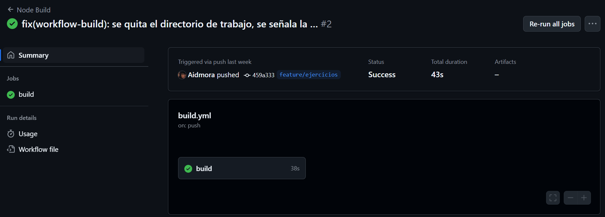
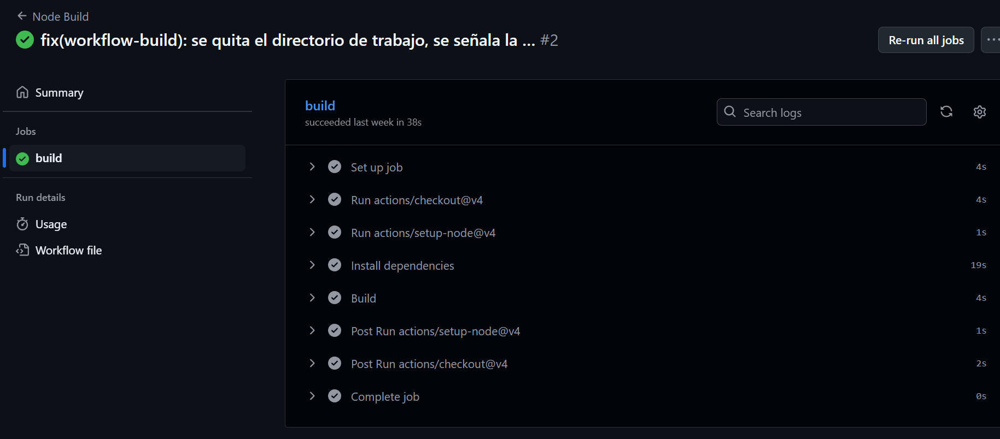
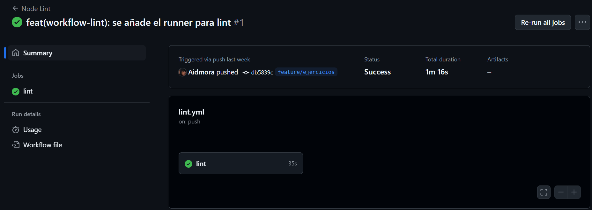
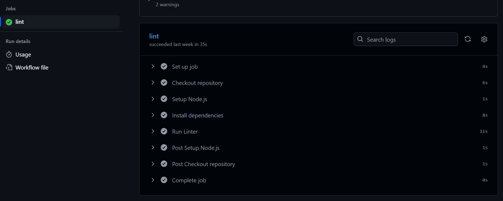
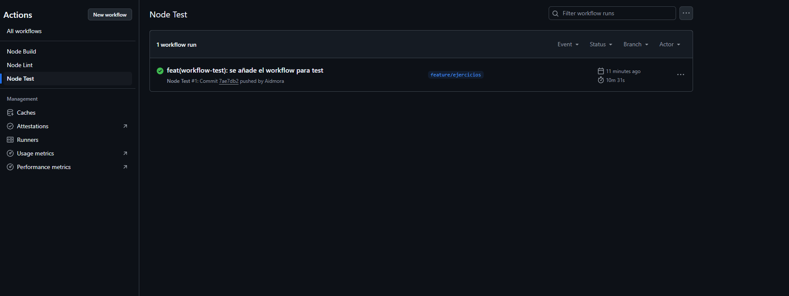
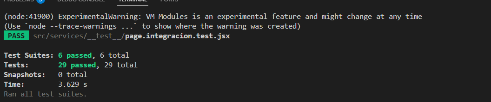

# Documentación del Proyecto DragonForge

A continuación se presenta la documentación de los archivos de configuración, pruebas unitarias/integración y Dockerfile de la aplicación DragonForge. Cada sección incluye el código completo del archivo y una descripción de su propósito.

---

## 1. Workflows de GitHub Actions

### 1.1 `build.yml`

```yaml
name: Node Build
on: [push]

jobs:
  build:
    runs-on: [self-hosted]

    steps:
      - uses: actions/checkout@v4

      - uses: actions/setup-node@v4
        with:
          node-version: '22.x'

      - name: Install dependencies
        run: npm ci       

      - name: Build
        run: npm run build 
```

**Propósito:**
Este workflow se ejecuta en cada *push* y despliega un runner `self-hosted`. Sus pasos:

1. **Checkout** del repositorio.
2. **Setup** de Node.js v22.x.
3. Instalación de dependencias con `npm ci`.
4. Compilación de la aplicación con `npm run build`.

> **Ejecución del workflow**

> 
> 


---

### 1.2 `lint.yml`

```yaml
name: Node Lint
on: [push]

jobs:
  lint:
    runs-on: [self-hosted]

    steps:
      - name: Checkout repository
        uses: actions/checkout@v4

      - name: Setup Node.js
        uses: actions/setup-node@v4
        with:
          node-version: '22.x'

      - name: Install dependencies
        run: npm ci

      - name: Run Linter
        run: npm run lint
```

**Propósito:**
Se encarga de ejecutar el linter (`npm run lint`) tras cada *push* en un runner `self-hosted`.

1. Clona el repositorio.
2. Prepara Node.js.
3. Instala dependencias.
4. Corre el linter.

> **Ejecución del workflow**
> 
> 
---
### 1.2 `test.yml`

```yaml
name: Node Test
on: [push]

jobs:
  lint:
    runs-on: [self-hosted]

    steps:
      - name: Checkout repository
        uses: actions/checkout@v4

      - name: Setup Node.js
        uses: actions/setup-node@v4
        with:
          node-version: '22.x'

      - name: Install dependencies
        run: npm ci

      - name: Run Linter
        run: npm test
```

**Propósito:**
Este workflow ejecuta los tests (`npm test`) tras cada *push* en un runner `self-hosted`.

1. Clona el repositorio.
2. Prepara Node.js.
3. Instala dependencias.
4. Corre los tests.

> **Ejecución del workflow**
> 
## 2. Pruebas Unitarias y de Integración

> **Ejecución de todos los tests**
> 

---

### 2.1 `EJERCICIOFORM.INTEGRACION.TEST.JSX`

```jsx
import React from 'react'
import '@testing-library/jest-dom'
import { render, screen, fireEvent, waitFor } from '@testing-library/react'
import { AuthContext } from '../../contexts/AuthContext'
jest.mock('../../services/usuarios', () => ({
  registerUser:    jest.fn(),
  loginUser:       jest.fn(),
  getUsuarios:     jest.fn(),
  getUsuarioPorId: jest.fn(),
  updateUsuario:   jest.fn(),
  updatePhenotipo: jest.fn(),
}))

const mockCrear = jest.fn(() => Promise.resolve({ id: 99 }))
jest.mock('../../services/ejercicios', () => ({
  crearEjercicio: (datos) => mockCrear(datos)
}))

import EjercicioForm from '../../components/EjercicioForm'

test('integra formulario y llama a crearEjercicio + onCreated', async () => {
  const onCreated = jest.fn()

  render(
    <AuthContext.Provider value={{ user: {}, setUser: jest.fn() }}>
      <EjercicioForm onCreated={onCreated} />
    </AuthContext.Provider>
  )
  fireEvent.change(screen.getByLabelText(/Nombre/i), {
    target: { value: 'X' }
  })
  fireEvent.change(screen.getByLabelText(/Grupo muscular/i), {
    target: { value: 'A,B' }
  })
  fireEvent.change(screen.getByLabelText(/Equipamiento/i), {
    target: { value: 'C' }
  })
  fireEvent.change(screen.getByLabelText(/Instrucciones/i), {
    target: { value: '...' }
  })
  fireEvent.click(screen.getByRole('button', { name: /Crear ejercicio/i }))
  await waitFor(() => expect(mockCrear).toHaveBeenCalledTimes(1))
  expect(onCreated).toHaveBeenCalled()
})

```

**Propósito:**

* Verifica la integración del componente `EjercicioForm` con el servicio `crearEjercicio`.
* Comprueba que, al rellenar y enviar el formulario, se invoque la llamada al servicio y luego `onCreated`.

---

### 2.2 `EJERCICIOS.UNIT.TEST.JS`

```js

import { jest } from '@jest/globals'
import { getEjercicios, crearEjercicio } from '../../services/ejercicios'

describe('servicios/ejercicios', () => {
  beforeEach(() => {
    global.fetch = jest.fn()
  })
  afterEach(() => {
    jest.resetAllMocks()
  })

  it('getEjercicios hace GET a /ejercicios y devuelve JSON', async () => {
    const fake = [{ id: 1, nombre: 'X' }]
    fetch.mockResolvedValueOnce({
      ok: true,
      json: () => Promise.resolve(fake)
    })

    const data = await getEjercicios()
    expect(fetch).toHaveBeenCalledWith('/api/ejercicios', expect.any(Object))
    expect(data).toEqual(fake)
  })

  it('getEjercicios lanza si fetch.ok es false', async () => {
    fetch.mockResolvedValueOnce({ ok: false, statusText: 'fail' })
    await expect(getEjercicios()).rejects.toThrow('fail')
  })

  it('crearEjercicio hace POST con JSON y devuelve respuesta', async () => {
    const payload = { nombre: 'Push ups' }
    const fakeRes = { id: 42, ...payload }
    fetch.mockResolvedValueOnce({
      ok: true,
      json: () => Promise.resolve(fakeRes)
    })

    const data = await crearEjercicio(payload)
    expect(fetch).toHaveBeenCalledWith('/api/ejercicios', {
      method: 'POST',
      headers: { 'Content-Type': 'application/json' },
      body: JSON.stringify(payload)
    })
    expect(data).toEqual(fakeRes)
  })

  it('crearEjercicio lanza si status no OK', async () => {
    fetch.mockResolvedValueOnce({ ok: false, statusText: 'err' })
    await expect(crearEjercicio({})).rejects.toThrow('err')
  })
})

```

**Propósito:**
Pruebas unitarias del servicio de ejercicios:

* `getEjercicios` (GET /api/ejercicios)
* `crearEjercicio` (POST /api/ejercicios)
  Verifica casos de éxito y error (`ok=true/false`).

---

### 2.3 `EJERCICIOSLIST.INTEGRACION.TEST.JSX`

```jsx
import React from 'react'
import '@testing-library/jest-dom'
import { render, screen, waitForElementToBeRemoved } from '@testing-library/react'
import { AuthContext } from '../../contexts/AuthContext'
import EjerciciosList from '../../components/EjerciciosList'
jest.mock('../../services/usuarios', () => ({
  registerUser:    jest.fn(),
  loginUser:       jest.fn(),
  getUsuarios:     jest.fn(),
  getUsuarioPorId: jest.fn(),
  updateUsuario:   jest.fn(),
  updatePhenotipo: jest.fn(),
}))
jest.mock('../../services/ejercicios', () => ({
  getEjercicios: () =>
    Promise.resolve([
      {
        id: 42,
        nombre: 'Prensa piernas',
        dificultad: 'Alta',
        grupo_muscular: ['Cuádriceps'],
        equipamiento: ['Máquina'],
        instrucciones: 'Siéntate…'
      }
    ])
}))

test('integra componente + servicio y muestra ejercicios', async () => {
  render(
    <AuthContext.Provider value={{ user: {}, setUser: jest.fn() }}>
      <EjerciciosList />
    </AuthContext.Provider>
  )
  const statuses = screen.getAllByRole('status')
  expect(statuses[0]).toBeInTheDocument()
  await waitForElementToBeRemoved(() => screen.queryAllByRole('status'))
  expect(screen.getByText('Prensa piernas')).toBeInTheDocument()
})
```

**Propósito:**
Prueba de integración de `EjerciciosList`:

* Simula la carga con spinner (`role="status"`).
* Reemplaza el mock de `getEjercicios`.
* Verifica que el nombre del ejercicio aparezca una vez cargado.

---

### 2.4 `FORMULARIO.UNIT.TEST.JSX`

```js
import { TextEncoder, TextDecoder } from 'util'
global.TextEncoder = TextEncoder
global.TextDecoder = TextDecoder

import React from 'react'
import '@testing-library/jest-dom'
import { render, screen, fireEvent } from '@testing-library/react'
import { MemoryRouter } from 'react-router-dom'
import FormularioLogin from '../../components/FormularioLogin'
import FormularioRegistro from '../../components/FormularioRegistro'
describe('FormularioLogin (unit)', () => {
  it('muestra valores iniciales en los inputs', () => {
    render(
      <MemoryRouter>
        <FormularioLogin
          email="foo@bar"
          password="123456"
          error={null}
          setEmail={() => {}}
          setPassword={() => {}}
          handleSubmit={() => {}}
        />
      </MemoryRouter>
    )
    expect(screen.getByLabelText(/Email/)).toHaveValue('foo@bar')
    expect(screen.getByLabelText(/Contraseña/)).toHaveValue('123456')
  })

  it('muestra mensaje de error cuando error no es null', () => {
    render(
      <MemoryRouter>
        <FormularioLogin
          email=""
          password=""
          error="Boom!"
          setEmail={() => {}}
          setPassword={() => {}}
          handleSubmit={() => {}}
        />
      </MemoryRouter>
    )
    expect(screen.getByText('Boom!')).toBeInTheDocument()
  })

  it('llama setEmail al cambiar el email', () => {
    const setEmail = jest.fn()
    render(
      <MemoryRouter>
        <FormularioLogin
          email=""
          password=""
          error={null}
          setEmail={setEmail}
          setPassword={() => {}}
          handleSubmit={() => {}}
        />
      </MemoryRouter>
    )
    fireEvent.change(screen.getByLabelText(/Email/), { target: { value: 'a@b' } })
    expect(setEmail).toHaveBeenCalledWith('a@b')
  })

  it('llama setPassword al cambiar la contraseña', () => {
    const setPassword = jest.fn()
    render(
      <MemoryRouter>
        <FormularioLogin
          email=""
          password=""
          error={null}
          setEmail={() => {}}
          setPassword={setPassword}
          handleSubmit={() => {}}
        />
      </MemoryRouter>
    )
    fireEvent.change(screen.getByLabelText(/Contraseña/), { target: { value: 'secret' } })
    expect(setPassword).toHaveBeenCalledWith('secret')
  })
})

describe('FormularioRegistro (unit)', () => {
  it('renderiza valores iniciales correctamente', () => {
    render(
      <FormularioRegistro
        nombre="Ariel"
        email="a@b"
        contrasenia="12345678"
        telefono="0999999999"
        error={null}
        setNombre={() => {}}
        setEmail={() => {}}
        setContrasenia={() => {}}
        setTelefono={() => {}}
        handleSubmit={() => {}}
      />
    )
    expect(screen.getByLabelText(/Nombre completo/)).toHaveValue('Ariel')
    expect(screen.getByLabelText(/^Email$/)).toHaveValue('a@b')
    expect(screen.getByLabelText(/Contraseña/)).toHaveValue('12345678')
    expect(screen.getByLabelText(/Teléfono/)).toHaveValue('0999999999')
  })

  it('llama setNombre al cambiar nombre', () => {
    const setNombre = jest.fn()
    render(
      <FormularioRegistro
        nombre=""
        email=""
        contrasenia=""
        telefono=""
        error={null}
        setNombre={setNombre}
        setEmail={() => {}}
        setContrasenia={() => {}}
        setTelefono={() => {}}
        handleSubmit={() => {}}
      />
    )
    fireEvent.change(screen.getByLabelText(/Nombre completo/), { target: { value: 'X' } })
    expect(setNombre).toHaveBeenCalledWith('X')
  })

  it('llama setEmail al cambiar email', () => {
    const setEmail = jest.fn()
    render(
      <FormularioRegistro
        nombre=""
        email=""
        contrasenia=""
        telefono=""
        error={null}
        setNombre={() => {}}
        setEmail={setEmail}
        setContrasenia={() => {}}
        setTelefono={() => {}}
        handleSubmit={() => {}}
      />
    )
    fireEvent.change(screen.getByLabelText(/^Email$/), { target: { value: 'x@y' } })
    expect(setEmail).toHaveBeenCalledWith('x@y')
  })

  it('llama setContrasenia al cambiar contraseña', () => {
    const setContrasenia = jest.fn()
    render(
      <FormularioRegistro
        nombre=""
        email=""
        contrasenia=""
        telefono=""
        error={null}
        setNombre={() => {}}
        setEmail={() => {}}
        setContrasenia={setContrasenia}
        setTelefono={() => {}}
        handleSubmit={() => {}}
      />
    )
    fireEvent.change(screen.getByLabelText(/Contraseña/), { target: { value: 'abc12345' } })
    expect(setContrasenia).toHaveBeenCalledWith('abc12345')
  })

  it('llama setTelefono al cambiar teléfono', () => {
    const setTelefono = jest.fn()
    render(
      <FormularioRegistro
        nombre=""
        email=""
        contrasenia=""
        telefono=""
        error={null}
        setNombre={() => {}}
        setEmail={() => {}}
        setContrasenia={() => {}}
        setTelefono={setTelefono}
        handleSubmit={() => {}}
      />
    )
    fireEvent.change(screen.getByLabelText(/Teléfono/), { target: { value: '0123' } })
    expect(setTelefono).toHaveBeenCalledWith('0123')
  })
})
```

**Propósito:**
Pruebas unitarias de los formularios de login y registro, cubriendo:

* Renderizado inicial.
* Cambios en inputs (`setX`).
* Mensajes de error.

---

### 2.5 `PAGE.INTEGRACION.TEST.JSX`

```js
import React from 'react'
import '@testing-library/jest-dom'
import { render, screen, fireEvent, waitFor } from '@testing-library/react'
import { MemoryRouter } from 'react-router-dom'
jest.mock('../../assets/DragonForge.png', () => null)
jest.mock('../../pages/css/LoginStyles.css', () => {})
jest.mock('../../pages/css/RegistroStyles.css', () => {})
jest.mock('../../services/usuarios', () => ({
  registerUser:    jest.fn(),
  loginUser:       jest.fn(),
  getUsuarios:     jest.fn(),
  getUsuarioPorId: jest.fn(),
  updateUsuario:   jest.fn(),
  updatePhenotipo: jest.fn(),
}))

import { AuthContext } from '../../contexts/AuthContext'
import Protected from '../../components/Protected'
import LoginPage from '../../pages/LoginPage'
import RegistroPage from '../../pages/RegistroPage'
import FormularioLogin from '../../components/FormularioLogin'
import FormularioRegistro from '../../components/FormularioRegistro'
describe('Protected (integration)', () => {
  it('muestra solo el mensaje de carga', () => {
    render(
      <AuthContext.Provider value={{ user: null, loading: true }}>
        <Protected><div>OK</div></Protected>
      </AuthContext.Provider>
    )
    expect(screen.getByText('Cargando...')).toBeInTheDocument()
  })

  it('redirige a /login si no hay usuario', () => {
    render(
      <MemoryRouter initialEntries={['/prot']}>
        <AuthContext.Provider value={{ user: null, loading: false }}>
          <Protected><div>Secret</div></Protected>
        </AuthContext.Provider>
      </MemoryRouter>
    )
    expect(screen.queryByText('Secret')).not.toBeInTheDocument()
  })

  it('renderiza children cuando user existe', () => {
    render(
      <AuthContext.Provider value={{ user: { id: 1 }, loading: false }}>
        <Protected><div>Secret</div></Protected>
      </AuthContext.Provider>
    )
    expect(screen.getByText('Secret')).toBeInTheDocument()
  })
})

describe('LoginPage (integration)', () => {
  it('muestra mensaje de error si login lanza', async () => {
    const login = jest.fn(() => Promise.reject(new Error('Fail login')))
    render(
      <AuthContext.Provider value={{ login }}>
        <MemoryRouter>
          <LoginPage />
        </MemoryRouter>
      </AuthContext.Provider>
    )
    fireEvent.change(screen.getByLabelText(/Email/i), { target: { value: 'e' } })
    fireEvent.change(screen.getByLabelText(/Contraseña/i), { target: { value: 'p' } })
    fireEvent.click(screen.getByRole('button', { name: /Continue/i }))
  })
})

describe('RegistroPage (integration)', () => {
  it('valida email sin @ y muestra error', () => {
    const register = jest.fn()
    render(
      <AuthContext.Provider value={{ register }}>
        <MemoryRouter>
          <RegistroPage />
        </MemoryRouter>
      </AuthContext.Provider>
    )
    fireEvent.change(screen.getByLabelText(/Email/i), { target: { value: 'no-at-sign' } })
    fireEvent.change(screen.getByLabelText(/Contraseña/i), { target: { value: '12345678' } })
    fireEvent.click(screen.getByRole('button', { name: /Registrarse/i }))
    expect(screen.getByText('El correo debe contener un “@”')).toBeInTheDocument()
    expect(register).not.toHaveBeenCalled()
  })

  it('valida contraseña corta y muestra error', () => {
    const register = jest.fn()
    render(
      <AuthContext.Provider value={{ register }}>
        <MemoryRouter>
          <RegistroPage />
        </MemoryRouter>
      </AuthContext.Provider>
    )
    fireEvent.change(screen.getByLabelText(/Email/i), { target: { value: 'a@b' } })
    fireEvent.change(screen.getByLabelText(/Contraseña/i), { target: { value: 'short' } })
    fireEvent.click(screen.getByRole('button', { name: /Registrarse/i }))
    expect(screen.getByText('La contraseña debe tener al menos 8 caracteres')).toBeInTheDocument()
    expect(register).not.toHaveBeenCalled()
  })
})
```

**Propósito:**
Pruebas de integración de páginas protegidas, login y registro:

* `Protected`: spinner, redirección y renderizado de hijos.
* `LoginPage`: captura de errores de login.
* `RegistroPage`: validaciones de email y contraseña.

### 2.5 `USUARIO.UNIT.TEST.JS`

```js
import { 
  beforeEach, 
  afterEach, 
  describe, 
  it, 
  expect, 
  jest 
} from '@jest/globals'

import { 
  registerUser, 
  loginUser, 
  getUsuarios, 
  getUsuarioPorId 
} from '../usuarios'

describe('Usuarios service (unit)', () => {
  beforeEach(() => {
    global.fetch = jest.fn()
  })
  afterEach(() => {
    jest.resetAllMocks()
  })

  describe('registerUser', () => {
    it('resuelve con los datos del usuario creado', async () => {
      const mockData = { id: 1, nombre: 'Ariel' }
      global.fetch.mockResolvedValueOnce({
        ok: true,
        json: () => Promise.resolve(mockData)
      })

      const result = await registerUser({ nombre: 'Ariel' })
      expect(global.fetch).toHaveBeenCalledWith(
        '/api/usuarios',
        expect.objectContaining({
          method: 'POST',
          body: JSON.stringify({ nombre: 'Ariel' })
        })
      )
      expect(result).toEqual(mockData)
    })

    it('lanza error si la respuesta no es ok', async () => {
      global.fetch.mockResolvedValueOnce({
        ok: false,
        statusText: 'Bad Request',
        text: () => Promise.resolve('Bad Request')
      })
      await expect(registerUser({})).rejects.toThrow('Bad Request')
    })
  })

  describe('loginUser', () => {
    it('resuelve con el token y usuario al loguear', async () => {
      const mockData = { token: 'abc123', user: { id: 1 } }
      global.fetch.mockResolvedValueOnce({
        ok: true,
        json: () => Promise.resolve(mockData)
      })

      const result = await loginUser({ email: 'e', password: 'p' })
      expect(global.fetch).toHaveBeenCalledWith(
        '/api/usuarios/login',
        expect.objectContaining({
          method: 'POST',
          body: JSON.stringify({ email: 'e', password: 'p' })
        })
      )
      expect(result).toEqual(mockData)
    })

    it('lanza error con credenciales inválidas', async () => {
      global.fetch.mockResolvedValueOnce({
        ok: false,
        statusText: 'Unauthorized',
        text: () => Promise.resolve('Unauthorized')
      })
      await expect(loginUser({ email: 'e', password: 'bad' }))
        .rejects.toThrow('Unauthorized')
    })
  })

  describe('getUsuarios', () => {
    it('resuelve con la lista de usuarios', async () => {
      const mockList = [{ id: 1 }, { id: 2 }]
      global.fetch.mockResolvedValueOnce({
        ok: true,
        json: () => Promise.resolve(mockList)
      })

      const result = await getUsuarios()
      expect(global.fetch).toHaveBeenCalledWith(
        '/api/usuarios',
        expect.any(Object)
      )
      expect(result).toEqual(mockList)
    })

    it('lanza error si falla la petición', async () => {
      global.fetch.mockResolvedValueOnce({
        ok: false,
        statusText: 'Error',
        text: () => Promise.resolve('Error')
      })
      await expect(getUsuarios()).rejects.toThrow('Error')
    })
  })

  describe('getUsuarioPorId', () => {
    it('resuelve con el usuario correcto', async () => {
      const mockUser = { id: 5, nombre: 'Foo' }
      global.fetch.mockResolvedValueOnce({
        ok: true,
        json: () => Promise.resolve(mockUser)
      })

      const result = await getUsuarioPorId(5)
      expect(global.fetch).toHaveBeenCalledWith(
        '/api/usuarios/5',
        expect.any(Object)
      )
      expect(result).toEqual(mockUser)
    })

    it('lanza error si no existe', async () => {
      global.fetch.mockResolvedValueOnce({
        ok: false,
        statusText: 'Not Found',
        text: () => Promise.resolve('Not Found')
      })
      await expect(getUsuarioPorId(999)).rejects.toThrow('Not Found')
    })
  })
})

```

**Propósito:**
Pruebas unitarias del servicio de usuarios:

* `registerUser`: registro de usuario y manejo de errores.
* `loginUser`: autenticación y validación de credenciales.
* `getUsuarios`: obtención de la lista de usuarios y manejo de fallos.
* `getUsuarioPorId`: consulta de usuario por ID y control de errores.

---

## 3. Dockerfile

```dockerfile
FROM node:18-alpine AS builder
WORKDIR /app
COPY package*.json ./
RUN npm ci
COPY . .
RUN npm run build          

FROM nginx:stable-alpine
RUN rm -rf /usr/share/nginx/html/*
COPY --from=builder /app/dist /usr/share/nginx/html
EXPOSE 80
CMD ["nginx", "-g", "daemon off;"]
```

**Propósito:**
Construye la aplicación React en un contenedor Node y luego sirve el contenido estático con Nginx:

1. **Stage `builder`:**

   * Usa `node:18-alpine`.
   * Instala dependencias (`npm ci`) y construye (`npm run build`).
2. **Stage final:**

   * Usa `nginx:stable-alpine`.
   * Limpia la carpeta `/usr/share/nginx/html`.
   * Copia el build generado.
   * Expone el puerto 80 y arranca Nginx.

---

## 4. Desarrolladores e Información

**Desarrolladores:**  
Ariel (ariel.mora@epn.edu.ec)
Fernando (fernando.nagua@epn.edu.ec)

**Repositorio:**  
[github.com/Aidmora/DragonForge](https://github.com/Aidmora/DragonForge)

**Docker Hub:**  
[hub.docker.com/r/aidmora/dragonforge-client](https://hub.docker.com/r/aidmora/dragonforge-client)

